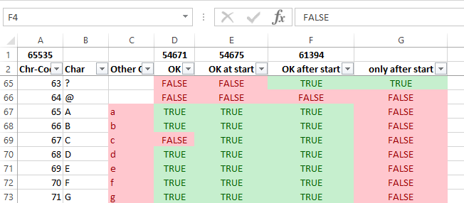

# excel-names
This repository contains an Excel Sheet with detailed info about valid 
letters in Excel Names and VBA source code to do some checks in code.
Excel 2013 has been used to create the sheet.

## Use-Cases
1. Download and check info in the [Excel Sheet](NameRulesUnicode64k.xlsm)
1. Copy the [VBA source code](VbaCode.md) to your VBA project and use it 

### Example Use-Case
You get a .csv file that contains row-headers in the first line and data.  
You should import the data and use the row-headers in the first line to
generate Excel Names.  

```csv
"Zeit hh:mm","Preis $","Preis/h","1"
08:00,127.12,25.17,17
...
```
The problem, is that you have no control over the row-headers, so they
could contain characters that are not allowed in Excel names.  
But you should of course keep the row-headers as readable as possible.

**Possible Solution**

Use `PrintAdjustedNames` to replace all invalid characters in the row-header with a valid char.

You should also consider to use a name-suffix that is always valid at the start: 
e.g. `n.` for better support of invalid start characters (e.g. numbers 1, 2, ..) 
and this also makes it easy to see/find all generated names in your Excel sheet.

| Row | Adjusted Name | Adjusted with Prefix |
| --- | --- | --- | 
| Zeit hh:mm | Zeit_hh_mm | n.Zeit_hh_mm | 
| Preis $ | Preis__ |n.Preis__  |
| Preis/h | Preis_h | n.Preis_h |
| 1 | \_1 | n.1 |

## Motivation
The Excel documentation is not very clear about which letters you may 
use for Excel Names:  
see [Learn about syntax rules for names](https://goo.gl/k4Ne1E)

>Valid characters The first character of a name must be a letter, 
> an underscore character (_), or a backslash ().
> Remaining characters in the name can be letters, numbers, 
> periods, and underscore characters.

But what exactly is a letter? You may think that this only refers to
 ASCII letters, but this is not true:  
You can also use any of the following characters (and many more) - 
tested in Excel 2013 with English locale:
- German umlauts: Ö,ö,Ü,ü, etc.
- French accents: é, ê, etc.
- many unicode characters: e.g. 䄀 (unicode 16640)

## How excel-names can help
### Excel Sheet
The [Excel Sheet](NameRulesUnicode64k.xlsm) contained in this repository
includes a table which shows information about each unicode character:


- A1: the number of rows that are currently displayed  
  When you filter the data (use the filter arrows in row 2), this number will change
- D/E/F1: number of valid rows in the current column
- Column A **Chr-Code**: this is the unicode character code
- Column B **Chr**: the character of the unicode in A (not all are printable)
- Column C **Other Case**: this column will contain the uppper/lowercase version of the character in B (if available)
- Column D **OK**: these characters can be used directly as an Excel Name.  
Thist set includes You can use 54,671 characters.
  - Valid examples: 
    - "a", "b"
    - underscore character (_)
    - backslash (\)
  - INVALID examples: "C", "c", "R", or "r", "$", ..
- Column E **OK at start**: these characters are usually okay at the start of an Excel Name (which consists of 2 or more chars).
  At the start you can use all characters from Column D plus "C", "c", "R", or "r".  
  So a total of 54,675 characters are allowed.
  - Valid examples: 
    - "ax", "bx", "cx", ..
    - "_x", "_z", ..
  - INVALID examples: 
    - "$a": $ is always invalid
    - "?a": ? is only valid after the start (e.g. "a?" is okay)
- Column F **OK after start**: these characters are usually okay after the start of an Excel Name (which consists of 2 or more chars).  
This is the least restrictive case. 61,394 characters are allowed.
  - Valid examples: 
    - "ax", "bx", "cx", "c?", ..
    - "_x", "\xx", "_?", ..
  - INVALID examples: 
    - "$a": $ is always invalid
    - "?a": ? is only valid after the start (e.g. "a?" is okay)  
- Column G **OK Switch**: a switch conists of the backslash and exactly one character: e.g. "\a"
  For Excel-Names on the Worksheet this is the same as **OK after start**, but for 
  Excel-Names on the Workbook all switches are invalid.
- Columns I to K are the same as D to H with the only difference that the names have been created on 
  the Workbook (instead of the Worksheet)  
  Note, there are 2 differences:
  - Column I: there are 2 characters (Unicode: 173, 1600) which are  invalid on the Workbook, but are valid on the Worksheet
  - Column K: all switches on the Workbook are invalid    
- Column L **only after start**: characters that are usually valid **only** after the start (but not at the start).  
  These 6,719 characters are invalid at the start, but valid after the start.
  - Included: "?": "a?" is valid, but "?a" is not
  - NOT included: "A": "Axy" is valid (at the start) and "xyA" is also valid (after the start)
- Column M **WB only after start**: same as L but for the Workbook

 **Usually valid** means that there can still be exceptions.
 Examples: 
- "C" is usually okay at the start:
  - "Cat" is a valid name
  - "C1" is not, because it is a cell-reference
- "\" is usually valid at the start
  - "\xyz" is okay
  - "\x" is not (switch)

For details, how this data has been generated see [DataGeneration](DataGeneration.md)  

### VBA code Quickstart

A quick description how to use the VBA code in your projects. For more details see: [VbaCode](VbaCode.md)  

- Copy the code of the following files to your VBA project:
  - [mExcelNameRulesData.bas](source/mExcelNameRulesData.bas)
  - [mExcelNameRules.bas](source/mExcelNameRules.bas)
- `Function Names_IsValidName(sNameToTest As String) As Boolean`  
  This function returns true, when you can probably use `sNameToTest` as an Excel Name.  
  "probably", because there may be edge cases that are currently not handled.  
  Examples:
  - `Names_IsValidName("Temparature")` returns `true`
  - `Names_IsValidName("Indoor Temp.")` returns `false` (space is not allowed)
- `Function Names_AdjustName(sNameToTest As String) As String`  
  This function returns a string that has been adjusted, so that it is probably a valid an Excel Name.  
  Examples:
  - `Names_AdjustName("Temperature")` returns `"Temperature"`
  - `Names_IsValidName("Indoor Temp.")` returns `"Indoor_Temp."` (space has been replaced with underscore)

# License
This is free and unencumbered software released into the public domain.

Anyone is free to copy, modify, publish, use, compile, sell, or
distribute this software, either in source code form or as a compiled
binary, for any purpose, commercial or non-commercial, and by any
means.

In jurisdictions that recognize copyright laws, the author or authors
of this software dedicate any and all copyright interest in the
software to the public domain. We make this dedication for the benefit
of the public at large and to the detriment of our heirs and
successors. We intend this dedication to be an overt act of
relinquishment in perpetuity of all present and future rights to this
software under copyright law.

THE SOFTWARE IS PROVIDED "AS IS", WITHOUT WARRANTY OF ANY KIND,
EXPRESS OR IMPLIED, INCLUDING BUT NOT LIMITED TO THE WARRANTIES OF
MERCHANTABILITY, FITNESS FOR A PARTICULAR PURPOSE AND NONINFRINGEMENT.
IN NO EVENT SHALL THE AUTHORS BE LIABLE FOR ANY CLAIM, DAMAGES OR
OTHER LIABILITY, WHETHER IN AN ACTION OF CONTRACT, TORT OR OTHERWISE,
ARISING FROM, OUT OF OR IN CONNECTION WITH THE SOFTWARE OR THE USE OR
OTHER DEALINGS IN THE SOFTWARE.

For more information, please refer to <http://unlicense.org/>
